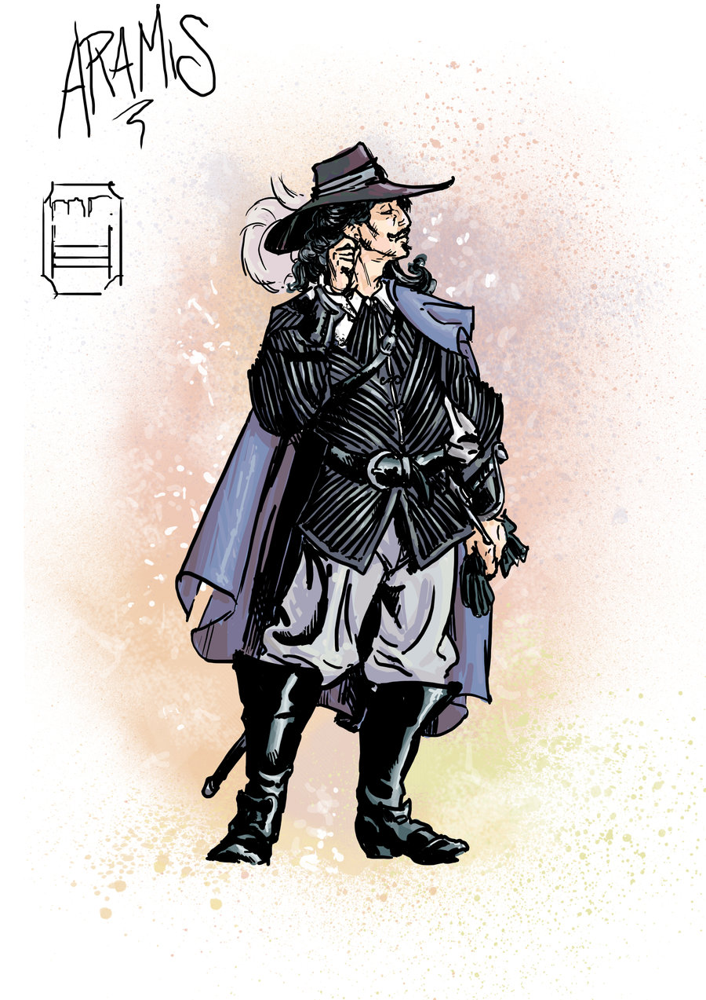

# Aramis: A memory model synthesizer

<p align="center"> 

</p>

Aramis is a prototype module for the tool suite [Dat3m](https://github.com/hernanponcedeleon/Dat3M/).

Requirements
======
* [Maven](https://maven.apache.org/)

Installation
======
Set the path and shared libraries variables (replace the latter by DYLD_LIBRARY_PATH in **MacOS**)
```
export PATH=<Dat3M's root>/:$PATH
export LD_LIBRARY_PATH=<Dat3M's root>/lib/:$LD_LIBRARY_PATH
```

To build the tool run
```
mvn install:install-file -Dfile=lib/z3-4.3.2.jar -DgroupId=com.microsoft -DartifactId="z3" -Dversion=4.3.2 -Dpackaging=jar
mvn clean install -DskipTests
```

Binaries
======
The precompiled jar can be found in the [release](https://github.com/florianfurbach/Aramis/releases) section.

Usage
======

```
java -jar aramis/target/aramis-2.0.3-jar-with-dependencies.jar -target <architecture> -p <POS program dir> -n <NEG program dir> [options]
```
The -p,-n options specify the paths of the directories that contain the litmus tests that should succeed (POS) and those that should fail (NEG).

For programs written in the .pts format, \<target> specifies the architectures to which the program will be compiled. 
They must be one of the following: 
- none
- tso
- power
- arm
- arm8

Other optional arguments include:
- -m, --mode {knastertarski, idl, kleene}: specifies the encoding for fixed points. Knaster-tarski (default mode) uses the encoding introduced in [2]. Mode idl uses the Integer Difference Logic iteration encoding introduced in [1]. Kleene mode uses the Kleene iteration encoding using one Boolean variable for each iteration step.
- -a, --alias {none, andersen, cfs}: specifies the alias-analysis used. Option andersen (the default one) uses a control-flow-insensitive method. Option cfs uses a control-flow-sensitive method. Option none performs no alias analysis.
- -unroll: unrolling bound for the BMC.
- -c,--constraints <arg>       Bound on the number of constraints in the synthesized model
- -b,--basicrelations <arg>    The basic relations the model uses
- -mr,--minusrelations <arg>   The relations to be used by the operator setminus.
- -dynamic                     Using dynamic programming by storing may pairs
- -v,--verbose                 Printing more information

Authors and Contact
======
**Maintainer of Aramis:**

* [Florian Furbach](mailto:f.furbach@tu-braunschweig.de)

**Developers of Dat3m:**

* [Hernán Ponce de León](mailto:hernan.ponce@unibw.de)
* [Natalia Gavrilenko](mailto:natalia.gavrilenko@aalto.fi)
* [Florian Furbach](mailto:f.furbach@tu-braunschweig.de)

Please feel free to contact us in case of questions or to send feedback.

References
======
[1] Hernán Ponce de León, Florian Furbach, Keijo Heljanko, Roland Meyer: **Portability Analysis for Weak Memory Models. PORTHOS: One Tool for all Models**. SAS 2017.

[2] Hernán Ponce de León, Florian Furbach, Keijo Heljanko, Roland Meyer: **BMC with Memory Models as Modules**. FMCAD 2018.

[3] Natalia Gavrilenko, Hernán Ponce de León, Florian Furbach, Keijo Heljanko, Roland Meyer: **BMC for Weak Memory Models: Relation Analysis for Compact SMT Encodings**. CAV 2019.

[4] Hernán Ponce de León, Florian Furbach, Keijo Heljanko, Roland Meyer: **Dartagnan: Bounded Model Checking for Weak Memory Models (Competition Contribution)**. TACAS 2020.
